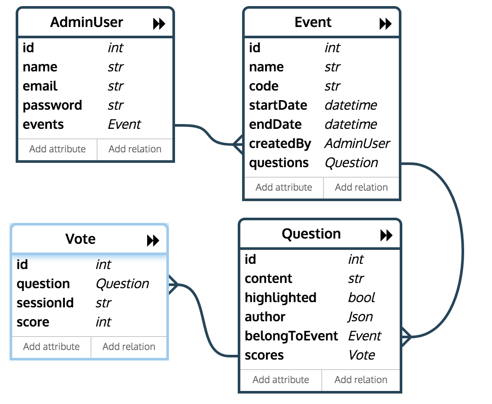

# README #

This README would normally document whatever steps are necessary to get your application up and running.

### What is this repository for? ###

This project helps user create event room and ask questions with realtime interaction.

### How do I run demo? ###

- You need to pull docker image by command: `docker pull thuyenho/qa-live:latest`

- After you pulled docker image, create a docker container from image: `docker run -t -i -p 3000:3000 -p 1337:1337 thuyenho/qa-live:latest` 

- In container, run a script `./start-project.sh` to start API server and  Web App.

Until now, you have successfully all related services, there are 2 main page:

- Admin Login Page: http://localhost:3000/admin/login - Using a account (email: demo@demo.com, password: 123456).

- Audience Page: http://localhost:3000/ - Typing event code (e.g. m01) to enter event room.

### Tech stack

- Programming language: Nodejs v9.6.1

- Frameworks: [sailsjs](next.sailsjs.com), [reactjs](https://reactjs.org/), [redux](redux.js.org), [material-ui](material-ui-next.com/), socker.io

- Database: mongodb

- Web development: ESlint, airbnb code style, [create-react-app](https://github.com/facebook/create-react-app)

### System designs

- Database schema relationship

- System

### TODO ###

- Using Redis for session and socket.io storages

- Creating user database schema to store anonymous user infomation intead of using web session

- Writing tests
